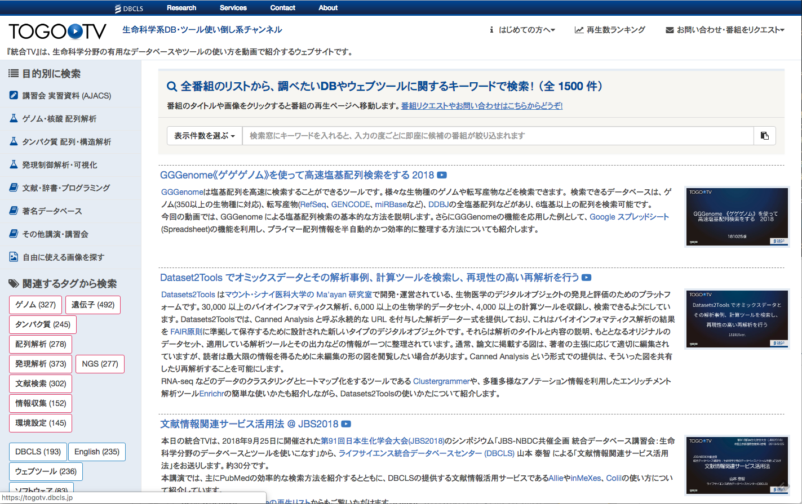
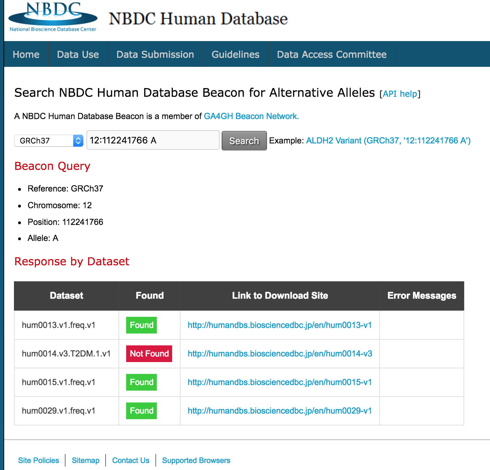
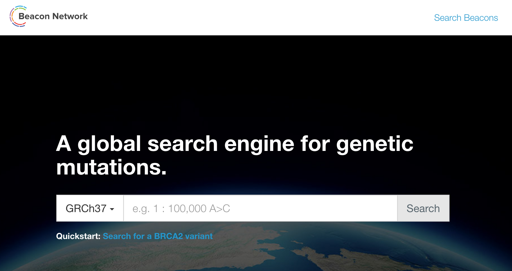
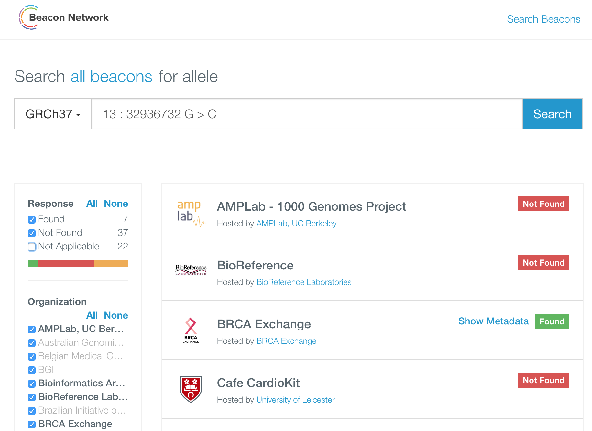
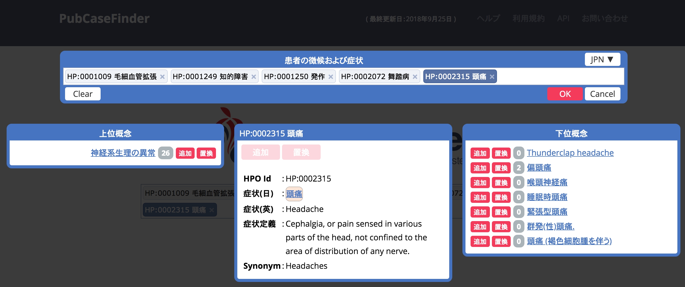
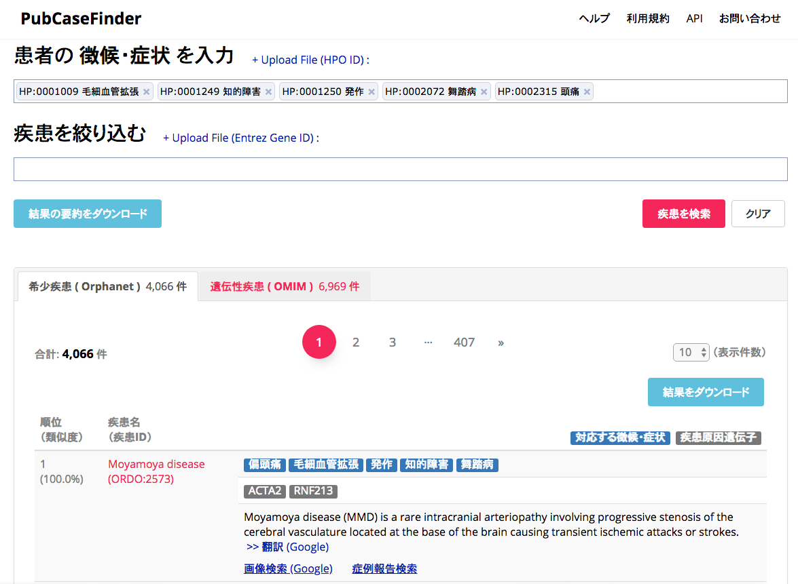

# ゲノムデータベースと次世代シーケンスデータベース
東京大学大学院理学系研究科
河野　信 kawano@bs.s.u-tokyo.ac.jp
2018年11月9日

----

これは統合データベース講習会AJACS蝦夷4「ゲノムデータベースと次世代シーケンスデータベース」の資料です。

© 2018 河野信, licensed under [Creative Commons Attribution 4.0 International license (CC-BY-4.0)](https://creativecommons.org/licenses/by/4.0/)

----

## 概要

本講習は、誰でも自由に使うことができる公共のデータベースやウェブツールを活用して、研究のさまざまな場面で利用することの多い（ヒトを含む）ゲノムデータベースや次世代シーケンスデータベースの使い方について学びます。
次世代シーケンスの解析方法について知りたい方も多いかと思いますが、3時間という短い時間ではとてもカバーできませんので、概要と資料の紹介に留めます。

## 講習の流れ
今回の講習では、以下の内容について順番に説明します。

- [研究現場で頻繁に使われるDBやツールを知る: 統合TV](#togotv)
- [DNAシーケンス技術](#seq)
- [塩基配列データベース](#seqdb)
- [配列検索ツール](#seqtool)
- [ゲノムデータベース](#genomedb)
- [ヒトゲノムデータベース](#humdb)
- [ヒトに関する情報を検索するツール](#humtool)

----

### 講習に際しての注意とお願い

- みんなで同時にアクセスするとサイトにつながりにくくなることが予想されます。
    - 資料を見ながら自力で進められそうな方はどんどん先に、そうでない方は講師と一緒にすすめていきましょう。
    - サイトの反応が悪い時はタイミングをずらして実行してみてください。
    - 反応が無いからと言って何度もクリックするとますます繋がらなくなってしまいます。おおらかな気持ちで臨みましょう。
- わからないことがあったら挙手にてスタッフにお知らせください。
    - 遠慮は無用です(そのための講習会です!)。おいてけぼりは楽しくありません。

----

## <a name="togotv">研究現場で頻繁に使われるDBやツールを知る</a>
### [統合TV](https://togotv.dbcls.jp/)とは？
- 生命科学分野の有用なデータベースやツールの使い方を動画で紹介するウェブサイト https://togotv.dbcls.jp/

- 本講習の課題に対応するチュートリアル動画が統合TVにあります
	- ウェブサイトへのアクセスから結果の見方まで、操作の一挙手一投足がわかります
	- 講義・講習などの参考資料や後輩指導の教材として利用できます
    - その他、今回の講習に関連する内容の多くは、[「ゲノム、核酸配列・構造解析」のカテゴリ](https://togotv.dbcls.jp/genome.html)にあります。
 - **過去の講習会の内容はそのほとんどが統合TVに収録**されており、いつでもどこでも**繰り返し復習できる**ようになっています。
 	- お探しのDB・ツールが統合TV未掲載の場合には、[統合TV番組リクエストフォーム](https://togotv.dbcls.jp/ja/contact.html)へどうぞ!

----

## <a name="seq">DNA シーケンス技術</a>
- サンガー法 v.s. 次世代シーケンス（NGS）
	- https://www.nature.com/articles/nbt1486/figures/1
- 次世代シーケンサー
	- https://flxlexblog.wordpress.com/2016/07/08/developments-in-high-throughput-sequencing-july-2016-edition/

----

## <a name="seqdb">塩基配列データベース</a>
### INSDC
- URL: http://www.insdc.org/

#### GenBank/ENA/DDBJ
- URL (GenBank): https://www.ncbi.nlm.nih.gov/genbank/
- URL (ENA): https://www.ebi.ac.uk/ena
- URL (DDBJ): https://www.ddbj.nig.ac.jp/index.html

##### 【演習】DDBJ 検索

#### SRA/ERA/DRA
- URL (SRA): https://www.ncbi.nlm.nih.gov/sra
- URL (ERA): 
- URL (DRA): https://www.ddbj.nig.ac.jp/dra/index.html

##### 【演習】DRA 検索
- 【統合TV】：

#### BioProject/BioSample

#### GEO/ArrayExpress/GEA
- URL (GEO): 
- URL (ArrayExpress): 
- URL (EGA): 

#### NGS データ解析について
- NGS講習会
- 【統合TV】: 
- 参考図書

----

## <a name="seqtool">配列検索ツール</a>
### 配列解析入門

配列解析の基本である配列アラインメントについて、BLASTを例にその検索アルゴリズムを解説する。

- ファイルフォーマット

| ファイルフォーマット | ファイル拡張子|用途など|
|----|----|----|
|FASTA	| .fa .fasta | 塩基配列、アミノ酸配列 |
|FASTQ|	.fq .fastq | NGSからの塩基配列とそのquality |
|DDBJ(Genbank)|	.dbj (.gbk) | メタデータを含んだ塩基配列やアミノ酸配列の記述 |
|SRA|	.sra | FASTQを圧縮したファイル形式|
|SAM/BAM|	.sam .bam |リファレンスゲノム配列へのアラインメント|
|GFF(GTF)|	.gff .gtf |ゲノムアノテーション|
|BED|	.bed |ゲノムアノテーション|
|VCF/BCF|	.vcf |バリアントの記述|

### BLAST
- URL (NCBI BLAST): 
- BLASTとは
	- Basic Local Alignment Search Tool
	- 配列類似性検索のデファクトスタンダード
- BLASTの動作原理
	- 質問配列(Query)
	- 検索対象DB(Sbjct)

- 質問配列とDBの組み合わせ→使うプログラム名が異なる
	- blastnだけが核酸配列レベルでの比較
	- 残り全てはアミノ酸配列レベルの比較

#### 【実習】BLAST 検索
- 【統合TV】: 
1. **"NCBI BLAST"** でググって、そのトップページを開く 

2. Nucleotide BLASTを選ぶ 

3. FASTA sequence(query)をペーストする。興味ある配列がない場合は、[例1](http://getentry.ddbj.nig.ac.jp/getentry/na/LC170036/?format=fasta&filetype=html&trace=true&show_suppressed=false&limit=10)か[例2](http://getentry.ddbj.nig.ac.jp/getentry/na/AB281053/?format=fasta&filetype=html&trace=true&show_suppressed=false&limit=10)を使いましょう。
4. 検索対象DBを選ぶ。まずは、デフォルトのまま(nr/nt)で。
5. BLASTボタンを押すと、検索が始まり、以下のような結果が得られる。

6. 検索対象DBを'Human genomic + transcript'にするなど、パラメータを変えて検索してみよう。

### GGRNA/GGGenome
- URL (GGRNA): https://ggrna.dbcls.jp/ja/
- URL

#### 【実習】配列の高速検索
- 【統合TV】: 

### CRISPERdirect

#### 【実習】CRISPER 配列を設計する

----

## <a name="genomedb">ゲノムデータベース</a>
### ゲノムデータベースとは？
- ゲノム配列をはじめとした（遺伝）情報を生物種ごとにまとめたデータベース
- 狭義にはゲノム配列のデータベースをいう

#### さまざまなゲノムデータベース
- [NCBI](https://www.ncbi.nlm.nih.gov/) (National Center for Biotechnology Information) の [**Genome**](https://www.ncbi.nlm.nih.gov/genome/)
  - [生物種ごと(Browse by Organism)](https://www.ncbi.nlm.nih.gov/genome/browse#!/overview/)
- [PlantGDB](http://www.plantgdb.org)
  - [Plant Genome Database Japan(PGDB)](http://pgdbj.jp/)
- 等々

### ゲノムブラウザとは？

- 塩基配列解読したゲノム配列とそこに付与（アノテーション）された情報を見るための仕組み
- オンライン型とローカル型
  - オンライン型：ウェブブラウザ上でサーバにあるゲノムデータベースから必要な情報を取り出してこれる
    - UCSC Genome Browser https://genome.ucsc.edu/
    - Ensembl Genome Browser https://www.ensembl.org/
    - NCBI Genome Data Viewer https://www.ncbi.nlm.nih.gov/genome/gdv/
    - TOGO GENOME http://togogenome.org/
  - ローカル型：手元のコンピュータにインストールして使用
    - Integrative Genomics Viewer(IGV) https://software.broadinstitute.org/software/igv/

#### 【実習】UCSC ゲノムブラウザを使ってみる
1. **"UCSC Genome Browser"** でググって、そのトップページを開く。
2. トップページにはツール名がリストされている。一番上にある **"Genome Browser"** をクリックする。

3. 最寄りのミラーサイトに接続するか訊いてくるので、指示に従う。

4. Genome Browserのページが開くので、生物種(**Human**)とアッセンブリ(**Feb.2009/(GRC37/hg19)**)を選んで、検索語を入力する。
5. FAM32A遺伝子のゲノム領域が表示される。
6. "Regulation"の"ENC TF Binding..."を"hide"から"show"に変更して、"refresh"ボタンを押す。
7. 転写因子結合サイトの情報が追加される。
8. いろいろ変更して表示してみましょう。わからなくなったら、図の下に並んでいるボタンの"default tracks"を押すと最初の状態に戻せます。

### DBTSS/DBKERO

----

## <a name="humdb">ヒト（ゲノム）データベース</a>
### Global Alliance for Genomics and Health (GA4GH)

### 制限公開データベース
- URL (dbGaP): 
- URL (EGA): 
- URL (JGA):

### NBDCヒトデータベース
- URL: https://humandbs.biosciencedbc.jp/

### TogoVar
- URL: https://togovar.biosciencedbc.jp/

#### 【実習】TogoVar を使ってみる
- 【統合TV】：[TogoVar でヒトゲノムに存在するバリアントに関連する情報を調べる](https://togotv.dbcls.jp/20180825.html)

----

## <a name="humtool">ヒトに関する情報を検索するツール</a>

### [NBDC Beacon]( https://humandbs.biosciencedbc.jp/beacon/api)
- URL: https://humandbs.biosciencedbc.jp/beacon/api
- Beaconとは興味のある変異がデータセット中にあるかどうかを知るためのサービスです
	- 例：1番染色体の12345番目のTがAであるデータセットはDB中にあるか？
- NBDC ヒトデータベースのオープンデータを使って試験公開しています
- 将来的には制限アクセスデータに対して検索できるようにする予定？です

#### 【実習】NBDC Beacon を使ってみる
1. NBDC ヒトデータベースでググって、トップページを開く
2. Example にあるリンクをクリックする
	1. GRCh37で12番染色体の112241766番目の塩基が ‘A’ のデータがデータセット中にあるか？

3. hum0013, hum0015, hum0029 には変異を含むデータが存在し、hum0014 には存在しないことがわかる

#### 【参考】[Beacon Network](http://beacon-network.org/)
- Beacon Network は世界中の Beacon サーバーを横断的に検索するシステムです

- 現在 38 機関、66 サーバが検索対象

---

### [PubCaseFinder](https://pubcasefinder.dbcls.jp/)
- URL: https://pubcasefinder.dbcls.jp/
- 希少疾患・症例を検索できる希少疾患診断支援システム
- 患者の症状をキーワードとして、疾患名および症例報告を関連性の高い順にランキング提示する
	- 希少疾患DBのOrphanet（https://www.orpha.net）：4000件の疾患
	- 遺伝性疾患DBのOMIM（https://www.omim.org）：7000件の疾患
	- PubMed（https://www.ncbi.nlm.nih.gov/pubmed/）：30万件の症例報告
- 特徴
	- Human Phenotype Ontology (HPO) による症状の標準化
	- テキストマイニングによる症状と疾患の自動抽出
	- 日本語の症例報告にも対応予定
- ライフサイエンス新着論文レビュー: [PubCaseFinder：症例報告を活用した希少疾患および遺伝性疾患の診断を支援するウェブサービス](http://first.lifesciencedb.jp/from_dbcls/e0003)

#### 【実習】PubCaseFinder を使ってみる
1. [PubCaseFinder](https://pubcasefinder.dbcls.jp/) でググって、トップページを開く
2. 入力ボックスの下にある例をクリックする
	1. 英語でも日本語でも入力できます
	2. 一部の文字を入力すると候補が出るのでそこから選択できます
	3. 入力した症状をクリックすると、症状の詳細な説明、上位概念・下位概念の症状が表示されるので、より適当な症状を選択することができます

3. 「疾患を検索」をクリックして検索します
	1. 関連度順に疾患名がリストされます
	2. 原因遺伝子の候補がある場合さらに絞り込むことができます
	3. 疾患に関連する画像（Google検索）や症例報告を見ることができます

