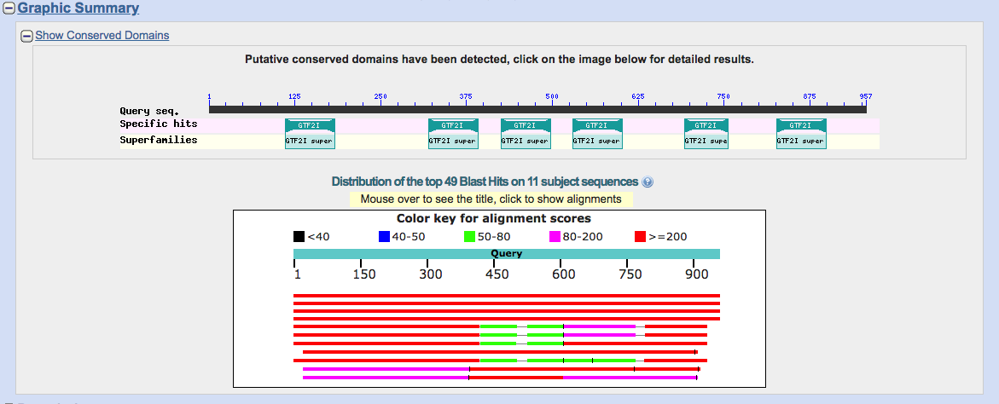
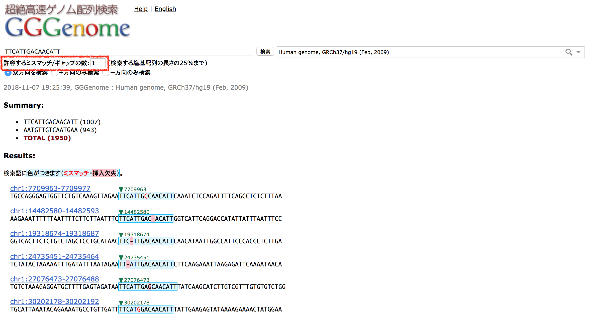
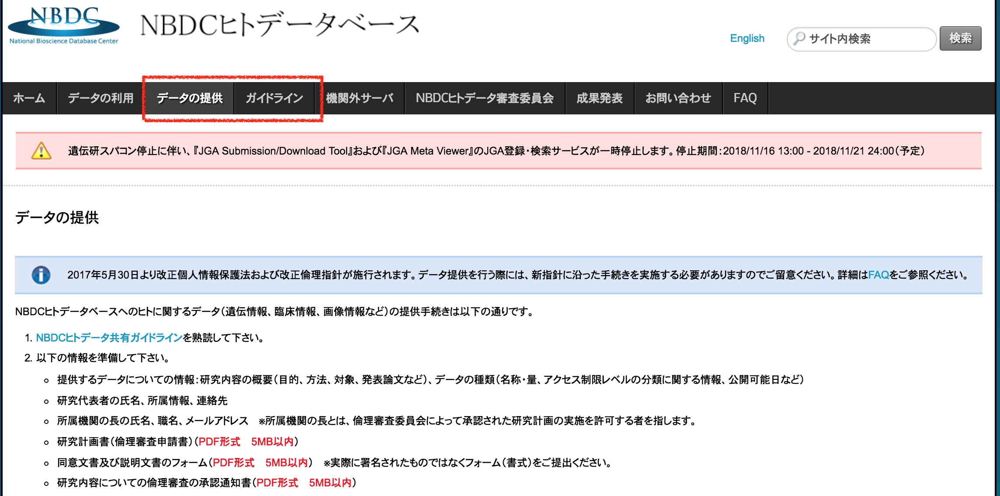
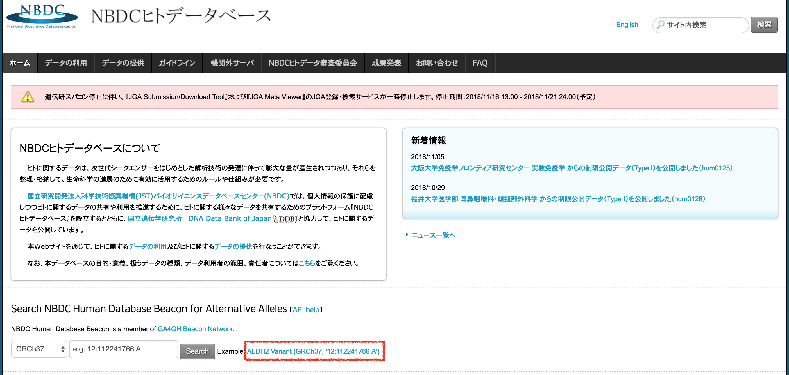

# ゲノムデータベースと次世代シーケンスデータベース
東京大学大学院理学系研究科

河野　信 kawano@bs.s.u-tokyo.ac.jp

2018年11月9日

----

これは統合データベース講習会AJACS蝦夷4「ゲノムデータベースと次世代シーケンスデータベース」の資料です。

© 2018 河野信, licensed under [Creative Commons Attribution 4.0 International license (CC-BY-4.0)](https://creativecommons.org/licenses/by/4.0/)

----

## 概要

本講習は、誰でも自由に使うことができる公共のデータベースやウェブツールを活用して、研究のさまざまな場面で利用することの多い（ヒトを含む）ゲノムデータベースや次世代シーケンスデータベースの使い方について学びます。
次世代シーケンスの解析方法について知りたい方も多いかと思いますが、3時間という短い時間ではとてもカバーできませんので、概要と資料の紹介に留めます。

## 講習の流れ
今回の講習では、以下の内容について順番に説明します。

- [研究現場で頻繁に使われるDBやツールを知る: 統合TV](#togotv)
- [DNAシーケンス技術](#seq)
- [塩基配列データベース](#seqdb)
- [配列検索ツール](#seqtool)
- [ゲノムデータベース](#genomedb)
- [ヒトゲノムデータベース](#humdb)
- [ヒトに関する情報を検索するツール](#humtool)

----

### 講習に際しての注意とお願い

- みんなで同時にアクセスするとサイトにつながりにくくなることが予想されます。
    - 資料を見ながら自力で進められそうな方はどんどん先に、そうでない方は講師と一緒にすすめていきましょう。
    - サイトの反応が悪い時はタイミングをずらして実行してみてください。
    - 反応が無いからと言って何度もクリックするとますます繋がらなくなってしまいます。おおらかな気持ちで臨みましょう。
- わからないことがあったら挙手にてスタッフにお知らせください。
    - 遠慮は無用です(そのための講習会です!)。おいてけぼりは楽しくありません。

----

## <a name="togotv">研究現場で頻繁に使われるDBやツールを知る</a>
### [統合TV](https://togotv.dbcls.jp/)とは？
- 生命科学分野の有用なデータベースやツールの使い方を動画で紹介するウェブサイト https://togotv.dbcls.jp/

- 本講習の課題に対応するチュートリアル動画が統合TVにあります
	- ウェブサイトへのアクセスから結果の見方まで、操作の一挙手一投足がわかります
	- 講義・講習などの参考資料や後輩指導の教材として利用できます
    - その他、今回の講習に関連する内容の多くは、[「ゲノム、核酸配列・構造解析」のカテゴリ](https://togotv.dbcls.jp/genome.html)にあります。
 - **過去の講習会の内容はそのほとんどが統合TVに収録**されており、いつでもどこでも**繰り返し復習できる**ようになっています。
 	- お探しのDB・ツールが統合TV未掲載の場合には、[統合TV番組リクエストフォーム](https://togotv.dbcls.jp/ja/contact.html)へどうぞ!

----
## 講演会のご案内
- [希少疾患インフォマティクス：情報保護・情報共有・社会実装](https://misshie.github.io/rdinfo2019/)
	- 日時：2019年2月16日（土） 17日（日）
	- 会場：JST東京本部別館2階会議室A-1・A-2（JR/地下鉄 市ヶ谷駅より徒歩３分）

---
## <a name="seq">DNA シーケンス技術</a>
- サンガー法 v.s. 次世代シーケンス（NGS）
	- https://www.nature.com/articles/nbt1486/figures/1
- 次世代シーケンサー
	- https://flxlexblog.wordpress.com/2016/07/08/developments-in-high-throughput-sequencing-july-2016-edition/

#### NGS を用いたアプリケーション
- Sequencing Methods Poster (Illumina)
	- https://emea.illumina.com/techniques/sequencing/ngs-library-prep/library-prep-methods.html
		- DNA ([PDF](https://emea.illumina.com/content/dam/illumina-marketing/documents/applications/ngs-library-prep/for-all-you-seq-dna.pdf))
		- RNA ([PDF](https://emea.illumina.com/content/dam/illumina-marketing/documents/applications/ngs-library-prep/for-all-you-seq-rna.pdf))
		- Single Cell ([PDF](https://emea.illumina.com/content/dam/illumina-marketing/documents/applications/ngs-library-prep/for-all-you-seq-single-cell.pdf))

----

## <a name="seqdb">塩基配列データベース</a>
### 塩基配列データベースで使用されるファイルフォーマット
| ファイルフォーマット | ファイル拡張子|用途など|
|----|----|----|
|FASTA	| .fa .fasta | 塩基配列、アミノ酸配列 |
|FASTQ|	.fq .fastq | NGSからの塩基配列とそのquality |
|DDBJ(Genbank)|	.dbj (.gbk) | メタデータを含んだ塩基配列やアミノ酸配列の記述 |
|SRA|	.sra | FASTQを圧縮したファイル形式|
|SAM/BAM|	.sam .bam |リファレンスゲノム配列へのアラインメント|
|GFF(GTF)|	.gff .gtf |ゲノムアノテーション|
|BED|	.bed |ゲノムアノテーション|
|VCF/BCF|	.vcf |バリアントの記述|

- 参考：[NGS ハンズオン講習会資料](https://biosciencedbc.jp/gadget/human/20160725_amelieff_20160803.pdf)

---

### データの種類とデータベース

### 一次データベースと二次データベース

### INSDC
- URL: http://www.insdc.org/
- International Nucleotide Sequence Database Collaboration
- 日米欧 3 極での塩基配列データベースについての協力体制
- 参加機関
	- 日本：DNA Data Bank Japan ([DDBJ](https://www.ddbj.nig.ac.jp/index.html))
	- 米国：National Center for Biotechnology Information ([NCBI](https://www.ncbi.nlm.nih.gov/))
	- 欧州：European Bioinformatics Institute ([EBI](https://www.ebi.ac.uk/))

---

### DDBJ/ENA/GenBank
- DNA 塩基配列およびそのアノテーション情報を登録するためのデータベース
- 登録されたデータは日米欧で毎日交換
- DDBJ から登録すると、日本語で対応してもらえます
- データベース
	- DDBJ (DDBJ): https://www.ddbj.nig.ac.jp/index.html
	- ENA - European Nucleotide Archive (EBI): https://www.ebi.ac.uk/ena
	- GenBank (NCBI): https://www.ncbi.nlm.nih.gov/genbank/

#### 【演習】DDBJ 検索
1. 「[DDBJ](https://www.ddbj.nig.ac.jp/index.html)」でググってトップページを開きます
2. 「検索・解析」の「ARSA」を開きます
	1. 「登録」からデータの登録が
	2. 「ダウンロード」からデータベースのまるごとダウンロードが
	3. 「スパコン」からスーパーコンピュータの利用申請（基本無料）ができます

3. キーワード（「ALDH1A1 human」）を入力して検索します

4. ヒットした配列の Accession 番号をクリックします
	1. ユーザによる登録ごとにエントリが作られるのでたくさんヒットします

- 検索結果（の一部）
	- これが DDBJ/GenBank フォーマットとよばれるものです

#### 【演習】NCBI (RefSeq) 検索
1. 「NCBI」でググってトップページを開きます
2. 先ほどとキーワード（「ALDH1A1 human」）を入力して検索します

- 遺伝子配列自体はたくさん登録されていますが、それらをまとめて整理した RefSeq は 1 エントリのみヒットしています

- RefSeq は DDBJ/GenBank フォーマットで書かれていますが、これを基にした遺伝子のページが充実しています

---

### DRA/ENA/SRA
- 次世代シーケンサから得られた生データもしくはマッピングデータを登録するデータベース
- データベース
	- DRA - DDBJ Read Archive (DDBJ): https://www.ddbj.nig.ac.jp/dra/index.html
	- ENA - European Nucleotide Archive (EBI): https://www.ebi.ac.uk/ena
	- SRA - Sequence Read Archive (NCBI): https://www.ncbi.nlm.nih.gov/sra
		- （一時期 Short Read Archive と呼ばれていた）

####  SRA データモデル

#### 【演習】DRA 検索
1. 「DDBJ [DRA](https://www.ddbj.nig.ac.jp/dra/index.html)」でググってトップページを開きます
2. 「検索」で検索ページを開きます
	1. 「ログイン・登録」からデータを登録できます

3. キーワード（「breast cancer」とか）を入力して検索します
	1. データベースに登録されている統計情報が表示されています

4. 検索結果の Accession をクリックします

5. Experiment や、サンプル、Run へのリンクから詳細な情報にアクセスできます
6. また、FASTQ 形式もしくは SRA 形式のファイルをダウンロードできます

---

### GEA/ArrayExpress/GEO
- 遺伝子発現のデータを格納するためのデータベース
- GEA が 2018 年 7 月から運用開始
- GEA ↔ ArrayExpress 間ではデータ交換予定
- ArrayExpress は GEO のデータを取り込んでいるが、GEO は ArrayExpress のデータを取り込んでいない
- データベース
	- GEA - Genomic Expression Archive (DDBJ): https://www.ddbj.nig.ac.jp/gea/index.html
	- ArrayExpress (EBI): https://www.ebi.ac.uk/arrayexpress/
	- GEO - Gene Expression Omnibus (NCBI): https://www.ncbi.nlm.nih.gov/geo/ 

---

### NGS データ解析について
- NGSのデータ解析はコマンドラインで実行するものが多く、習得に時間がかかります（3時間ではとても無理です！）
- ここでは資料を提示するのにとどめます
	- NGS ハンズオン講習会（資料、統合TVあり）
		- [平成 29 年](https://biosciencedbc.jp/human/human-resources/workshop/h29)　[カリキュラム・講義資料・動画](https://biosciencedbc.jp/human/human-resources/workshop/h29#curriculum)
		- [平成 28 年](https://biosciencedbc.jp/human/human-resources/workshop/h28)　[カリキュラム・講義資料・動画](https://biosciencedbc.jp/human/human-resources/workshop/h28-2)
		- [平成 27 年](https://biosciencedbc.jp/human/human-resources/workshop/h27)　[カリキュラム・講義資料・動画](https://biosciencedbc.jp/human/human-resources/workshop/h27)
		- [平成 26 年](https://biosciencedbc.jp/human/human-resources/workshop/h26)　[カリキュラム・講義資料・動画](https://biosciencedbc.jp/human/human-resources/workshop/h26)
	- 次世代シークエンサー DRY 解析読本
	
	
	
	- ライフサイエンス QA
		- URL: http://qa.lifesciencedb.jp/
		- バイオ分野の質問サイトです

#### 【参考】JGA-NGS データセット作成時の解析プログラム一覧
- TogoVar（後述）のデータ解析に使っているプログラム群です
- これ以外にも目的に応じてたくさんのプログラムが、多くの場合無償で提供されています

----

## <a name="seqtool">配列検索ツール</a>
### BLAST
- URL (NCBI BLAST): https://blast.ncbi.nlm.nih.gov/Blast.cgi
- 配列解析の基本である配列アラインメントについて、BLASTを例にその検索アルゴリズムを解説する
	- Basic Local Alignment Search Tool
	- 配列類似性検索のデファクトスタンダード
	- DNA 塩基配列とタンパク質アミノ酸配列の検索が可能
- BLASTの動作原理
	- 質問配列 (Query)
	- 検索対象DB (Sbjct)

- 質問配列と DB の組み合わせ→使うプログラム名が異なる
	- blastn だけが核酸配列レベルでの比較
	- 残りアミノ酸配列レベルの比較

#### 【実習】BLAST 検索
- 【統合TV】: [NCBI BLASTの使い方 〜基本編〜 2017](http://togotv.dbcls.jp/20170321.html)
1. 「NCBI BLAST」でググって、トップページを開く
2. Nucleotide BLASTを選ぶ 
 

3. FASTA sequence (query)をペーストする。[例1](http://getentry.ddbj.nig.ac.jp/getentry/na/LC170036/?format=fasta&filetype=html&trace=true&show_suppressed=false&limit=10)・[例2](http://getentry.ddbj.nig.ac.jp/getentry/na/AB281053/?format=fasta&filetype=html&trace=true&show_suppressed=false&limit=10)
4. 検索対象DBとアルゴリズムを選ぶ。まずはデフォルトのまま（nr/nt、megablast）で

5. BLASTボタンを押すと検索が始まり以下のような結果が得られる
	1. 検索の概要＋Graphic Summary
	

	2. ヒットした配列の概要
	

	3. ヒットした配列のアラインメント
	

#### 【発展】Protein BLAST 、Local BLAST
- Protein BLAST も試してみましょう
	- [GTFII-I](https://www.uniprot.org/uniprot/P78347-2.fasta) のアミノ酸配列を UniProtKB/SwissProt データベースに対して検索した結果

- 大量に検索する場合、独自のデータベース対して検索する場合などは、自分の PC にインストールして使えます
	- 統合TV：[Local BLASTの使い方〜導入・準備編(MacOSX版)〜2017](https://doi.org/10.7875/togotv.2017.031)
	- 統合TV：[Local BLASTの使い方〜検索実行・オプション(MacOSX版)〜2017](https://doi.org/10.7875/togotv.2017.045)

---

### [GGGenome](https://gggenome.dbcls.jp/ja/)/[GGRNA](https://ggrna.dbcls.jp/ja/)
- 超絶高速ゲノム検索 GGGenome
	- URL (GGGenome): https://gggenome.dbcls.jp/ja/
	- 検索対象：ゲノム配列
	- 入力：塩基配列
	- 特徴：ミスマッチ/ギャップがあっても検索可能
- 統合遺伝子検索 GGRNA
	- URL (GGRNA): https://ggrna.dbcls.jp/ja/
	- 検索対象：RefSeq の転写産物
		- mRNA: NM、XM からはじまるエントリ
		- ncRNA: NR、XR からはじまるエントリ
	- 入力：遺伝子名、キーワード、Accession 番号、塩基配列、アミノ酸配列、マイクロアレイのプローブ ID など

#### 【実習】GGGenome による塩基配列の高速検索
- 【統合TV】: [GGGenome《ゲゲゲノム》を使って高速塩基配列検索をする 2018](http://togotv.dbcls.jp/20181026.html)
1. 「GGGenome」でググってトップページを開きます
2. 「塩基配列」と「検索対象ゲノム」を指定して検索します（「検索例」に塩基配列があるのでコピペ or クリックします）

3. ＋方向に 15 配列、相補鎖に 8 配列ヒットしています
	- 検索配列が短いとたくさんヒットします

4. 「許容するミスマッチ/ギャップの数」を指定してみます
	- ヒット数が大幅に増えたのがわかります

#### 【参考】GGRNA による遺伝子の高速検索
- 【統合TV】:[GGRNAで遺伝子をGoogleのように検索する](http://togotv.dbcls.jp/20120124.html)
- GGRNA のトップページを開くと検索例のリンクがあるので、いろいろクリックしてみましょう

---

### CRISPRdirect
- URL: https://crispr.dbcls.jp/
- ゲノム編集ツール CRISPR-Cas9 システムに使用するガイドRNA 設計ツール
- PAM に隣接し、特異性の高い20塩基を選択
	- PAM (Protospacer adjacent motif) に隣接する配列の選択
	- オフターゲット配列検索（GGGenome を利用）
- 多くの生物種に対応
	- 650 種以上の生物種に対応（GGGenome と同じ）
		- Help ページに現在対応している生物種の一覧があります
	- CRISPRdirect/GGGenome 共、追加してほしい生物種（ゲノムが公開されているものに限る）がありましたら、[ここから](http://dbcls.rois.ac.jp/contact.html)お知らせください！

#### 【実習】CRISPR 配列を設計する
- 【統合TV】: [CRISPRdirectを使ってCRISPR/Cas法のガイドRNA配列を設計する](http://togotv.dbcls.jp/20140412.html)
1. 「[CRISPRdirect](https://crispr.dbcls.jp/)」でググってトップページを開く
2. 「Accession 番号」 or 「塩基配列」、「PAM」、「生物種」を入力

2. CRISPRdirect 結果

----

## <a name="genomedb">ゲノムデータベース</a>
### ゲノムデータベースとは？
- ゲノム配列をはじめとした（遺伝）情報を生物種ごとにまとめたデータベース
- 狭義にはゲノム配列のデータベースをいう

#### さまざまなゲノムデータベース
- [NCBI](https://www.ncbi.nlm.nih.gov/) (National Center for Biotechnology Information) の [**Genome**](https://www.ncbi.nlm.nih.gov/genome/)
  - [生物種ごと(Browse by Organism)](https://www.ncbi.nlm.nih.gov/genome/browse#!/overview/)
- [PlantGDB](http://www.plantgdb.org)
  - [Plant Genome Database Japan(PGDB)](http://pgdbj.jp/)
- [MicrobeDB.jp](http://microbedb.jp/MDB/)

#### コミュニティによるゲノムデータベース

- Mouse Genome Informatics (MGI) - マウス
	- http://www.informatics.jax.org/
- Rat Genome Database (RGD) - ラット
	- https://rgd.mcw.edu/
- WormBase - 線虫
	- https://www.wormbase.org/
- FlyBase - ショウジョウバエ
	- http://flybase.org/
- The Arabidopsis Information Resource (TAIR) - シロイヌナズナ
	- https://www.arabidopsis.org/
- Saccharomyces Genome Database (SGD) - 酵母
	- https://www.yeastgenome.org/
- CyanoBase - シアノバクテリア（光合成細菌）
	- http://genome.microbedb.jp/cyanobase/

---

### ゲノムブラウザとは？

- 塩基配列解読したゲノム配列とそこに付与（アノテーション）された情報を見るための仕組み
- オンライン型とローカル型
  - オンライン型：ウェブブラウザ上でサーバにあるゲノムデータベースから必要な情報を取り出してこれる
    - UCSC Genome Browser https://genome.ucsc.edu/
    - Ensembl Genome Browser https://www.ensembl.org/
    - NCBI Genome Data Viewer https://www.ncbi.nlm.nih.gov/genome/gdv/
    - TOGO GENOME http://togogenome.org/
  - ローカル型：手元のコンピュータにインストールして使用
    - Integrative Genomics Viewer(IGV) https://software.broadinstitute.org/software/igv/

#### 【実習】UCSC ゲノムブラウザを使ってみる
- 【統合TV】: [UCSC Genome Browser を使って様々な組織、細胞における遺伝子発現データをゲノムブラウザで表示する](http://togotv.dbcls.jp/ja/20171116.html)
1. 「[UCSC Genome Browser](https://genome.ucsc.edu/)」でググって、トップページを開く。
2. トップページにはツール名がリストされている。一番上にある「Genome Browser」をクリックする。

3. 最寄りのミラーサイトに接続する

4. Genome Browserのページが開くので、生物種「Human」とアッセンブリ「Feb.2009/(GRC37/hg19)」を選んで、検索語（ここでは「FAM32A」）を入力する

5. FAM32A遺伝子のゲノム領域が表示される

6. 「Regulation」の「ENC TF Binding...」を「hide」から「show」に変更して、「refresh」ボタンを押す。

7. 転写因子結合サイトの情報が追加される。

8. いろいろ変更して表示してみましょう。わからなくなったら、図の下に並んでいるボタンの「default tracks」を押すと最初の状態に戻せます。

---

### [DBTSS](https://dbtss.hgc.jp/)/[DBKERO](http://kero.hgc.jp/)
- DataBase of Transcriptional Start Site/DataBase of Kashiwa Encyclopedia for human genome mutation in Regulatory region and their Omics contexts
	- DBTSS URL: https://dbtss.hgc.jp/
	- DBKERO URL: http://kero.hgc.jp/
- ヒト細胞の各種オミクスデータを集積したデータベース
	- 全ゲノム（WGS）
	- トランスクリプトーム（RNA-seq）
	- エピゲノム（BS-seq, ChIP-seq）
	- 転写開始地点（TSS-seq）
	- シングルセルデータ
	- ロングリードデータ

----

## <a name="humdb">ヒト（ゲノム）データベース</a>
### Global Alliance for Genomics and Health ([GA4GH](https://www.ga4gh.org/))
- GA4GH: Global Alliance for Genomics and Health
	- URL: https://www.ga4gh.org/
- ヒトのゲノムデータ・医療情報を国際的に共有するためのルール・標準を作成

- [Work Streams](https://www.ga4gh.org/how-we-work/workstreams/)
	- Data Security
	- Regulatory & Ethics
	- Cloud
	- Data Use & Researcher Identities (DURI)
	- ...
- [Driver Project](https://www.ga4gh.org/how-we-work/driver-projects/)
	- [MatchMaker Exchange](http://www.matchmakerexchange.org/)
	- [ELIXIR Beacon](https://www.elixir-europe.org/about/implementation-studies/beacons)
	- Clinical Genome Resource ([ClinGen](https://www.clinicalgenome.org/))
	- [ENA](https://www.ebi.ac.uk/ena)/[EVA](https://www.ebi.ac.uk/eva/)/[EGA](https://www.ebi.ac.uk/ega/home)
	- (AMEB Umbrella Project)
	- ...

---

### 制限公開データベース
- Controlled Access（制限公開）が必要なヒトに関するデータを収集・公開する
	- URL (dbGaP: The database of Genotypes and Phenotypes): https://www.ncbi.nlm.nih.gov/gap
	- URL (EGA: European Genome-phenome Archive): https://www.ebi.ac.uk/ega/home
	- URL (JGA: Japanese Genotype-phenotype Archive): https://www.ddbj.nig.ac.jp/jga/index.html

---

### NBDCヒトデータベース
- URL: https://humandbs.biosciencedbc.jp/
- データの種類

- JGA のデータ提供申請・審査
	- データ提供の必要性
		- 論文投稿時に公的 DB へのデータ登録とアクセッション番号の記載が必須
		- 予算申請時に AMED [データマネージメントプラン](https://docs.google.com/viewer?url=https%3A%2F%2Fwww.amed.go.jp%2Fcontent%2F000004577.docx)提出の義務化
	- データ提供に必要な手続き
		- 研究計画書、同意文書（IC）および説明文書、倫理審査の承認通知書等
		- 特にデータ提供に関する同意を取得しておくことが重要

- データ共有の仕組み

- 制限公開データの利用
	- データ利用申請・審査が必要
		- 研究計画、倫理審査の承認通知書等
		- 年1回利用報告義務あり
	- 利用者の所属組織以外のサーバでも、認定された機関外サーバであれば、ダウンロードして利用可能
	

---

### [TogoVar](https://togovar.biosciencedbc.jp/)
- URL: https://togovar.biosciencedbc.jp/
- NBDC ヒトデータベースと TogoVar の関係

- 日本人ゲノム多様性統合データベース
	- NBDCヒトデータベースを基に個人特定されない加工データ（頻度情報）を提供
	- 日本や海外で公開されている頻度情報、ゲノム多様性と疾患との関連情報を統合、ワンストップで検索可能に
- 検索対象データベース
	- NBDC ヒトデータベース（125人全エクソーム/183884人マイクロアレイ）
	- [iJGVD](https://ijgvd.megabank.tohoku.ac.jp/): Integrated Japanese Genome Variation Database（3554人全ゲノム）
	- [HGVD](http://www.hgvd.genome.med.kyoto-u.ac.jp/): Human Genetic Variation Database（1208人全ゲノム）
		- 東北メディカルメガバンク
	- [ExAC](http://exac.broadinstitute.org/): Exome Aggregation Consortium（60706人全エクソーム）
		- 京都大学（長浜コホート）
	- [ClinVar](https://www.ncbi.nlm.nih.gov/clinvar/)（バリアントの疾患関連知識ベース）
		- Broad Institute
	- [PubTator](https://www.ncbi.nlm.nih.gov/CBBresearch/Lu/Demo/PubTator/) (NCBI)/[Colil](http://colil.dbcls.jp/browse/papers/) (DBCLS) （文献情報）
- NBDC ヒトデータベースに登録された日本人のゲノムデータの一部から集計した大規模なバリアントの頻度情報のデータセットを公開
	- 今後1026人分の全ゲノムデータを追加予定

#### 【実習】TogoVar を使ってみる
- 【統合TV】：[TogoVar でヒトゲノムに存在するバリアントに関連する情報を調べる](https://togotv.dbcls.jp/20180825.html)
1. 「[TogoVar](https://togovar.biosciencedbc.jp/)」でググってトップページを開きます
2. 遺伝子名、疾患名、rs 番号、ゲノム位置や範囲での検索が可能です
	1. ここでは「Breast-ovarian cancer, familial 2」で検索してみます
	
- TogoVar の画面構成

3. 左側にリストされている項目で検索結果の絞り込みができます
	1. データセット、頻度、変異の種類、疾患の関連度など
	2. まず「SNV」のみを絞り込んでみます
	
	3. 次に JGA NGS データセットでのアリル頻度が 0.1 (10%) 以下の変異で絞り込んでみます
	
4. ID 欄に表示されている tgv ID をクリックすると変異の詳細が表示されます
	1. ここでは上から13番目にある「[tgv48209632](https://togovar.biosciencedbc.jp/variant/tgv48209632)」（全データセットで検出されている変異）をクリックしてみます
	
5. 下にスコロールしていくと詳細情報が表示されます
	1. 各データセットでの詳細な頻度情報（データがあれば Genotype 情報も）
	
	2. 周辺の変異情報（ゲノムブラウザ）
	

----

## <a name="humtool">ヒトに関する情報を検索するツール</a>

### [NBDC Beacon]( https://humandbs.biosciencedbc.jp/beacon/api)
- URL: https://humandbs.biosciencedbc.jp/beacon/api
- Beaconとは興味のある変異がデータセット中にあるかどうかを知るためのサービスです
	- 例：1番染色体の12345番目のTがAであるデータセットはDB中にあるか？
- NBDC ヒトデータベースのオープンデータを使って試験公開しています
- 将来的には制限アクセスデータに対して検索できるようにする予定？です

#### 【実習】NBDC Beacon を使ってみる
1. 「[NBDC ヒトデータベース](https://humandbs.biosciencedbc.jp/)」 でググって、トップページを開く
2. Example にあるリンクをクリックする
	1. GRCh37で12番染色体の112241766番目の塩基が ‘A’ のデータがデータセット中にあるか？

3. hum0013, hum0015, hum0029 には変異を含むデータが存在し、hum0014 には存在しないことがわかる

#### 【参考】[Beacon Network](http://beacon-network.org/)
- Beacon Network は世界中の Beacon サーバーを横断的に検索するシステムです

- 現在 38 機関、66 サーバが検索対象

---

### [PubCaseFinder](https://pubcasefinder.dbcls.jp/)
- URL: https://pubcasefinder.dbcls.jp/
- 希少疾患・症例を検索できる希少疾患診断支援システム
- 患者の症状をキーワードとして、疾患名および症例報告を関連性の高い順にランキング提示する
	- 希少疾患DBのOrphanet（https://www.orpha.net）：4000件の疾患
	- 遺伝性疾患DBのOMIM（https://www.omim.org）：7000件の疾患
	- PubMed（https://www.ncbi.nlm.nih.gov/pubmed/）：30万件の症例報告
- 特徴
	- Human Phenotype Ontology (HPO) による症状の標準化
	- テキストマイニングによる症状と疾患の自動抽出
	- 日本語の症例報告にも対応予定
- ライフサイエンス新着論文レビュー: [PubCaseFinder：症例報告を活用した希少疾患および遺伝性疾患の診断を支援するウェブサービス](http://first.lifesciencedb.jp/from_dbcls/e0003)

#### 【実習】PubCaseFinder を使ってみる
1. 「[PubCaseFinder](https://pubcasefinder.dbcls.jp/)」 でググって、トップページを開く
2. 入力ボックスの下にある例をクリックする
	1. 英語でも日本語でも入力できます
	2. 一部の文字を入力すると候補が出るのでそこから選択できます
	3. 入力した症状をクリックすると、症状の詳細な説明、上位概念・下位概念の症状が表示されるので、より適当な症状を選択することができます

3. 「疾患を検索」をクリックして検索します
	1. 関連度順に疾患名がリストされます
	2. 原因遺伝子の候補がある場合さらに絞り込むことができます
	3. 疾患に関連する画像（Google検索）や症例報告を見ることができます

---
### 【おまけ】DDBJ のスパコンについて
- URL: https://sc.ddbj.nig.ac.jp/ja
- 日本のアカデミア機関に所属していれば基本的に無料で利用できます
	- 年度末の利用報告義務あり
- 大量のデータを扱う場合（研究グループで30TBを超える場合）は有料
- 個人ゲノム解析環境を利用する場合も有料
- 基本的にコマンドラインからログインして利用する
	- 一部、ウェブから利用できるものもある（[MiGAP](https://www.migap.org/)、[DDBJ Pipeline](https://p.ddbj.nig.ac.jp/pipeline/Login.do)）
- 無料なので結構混んでいるらしいです
- 夏場はたまに停電で停止することがあります